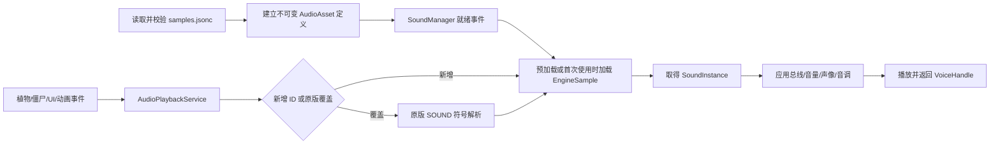

# 外部音频注册与原版音频替换方案

本文定义 `PlantsVsZombies.exe 1.0.0.1051` 的外部音频技术路线。目标包括两件互不混淆的能力：

1. 注册新的短音效或音乐，并由植物、僵尸、UI、动画事件、关卡和以后脚本接口按字符串 ID 播放；
2. 按原版音频符号做稀疏替换，只覆盖配置中列出的音频，未列出的资源完全保持原版。

当前 DLL 已完成第一阶段短音效垂直切片：配置解析、原版 DSoundManager 动态加载、全部 167 个 `SOUND_*` 运行时目录、中央稀疏替换、字符串 ID 播放入口与失败回退。尚未完成的部分包括游戏内实音频验收、资源热重载、每资源音量/音调/并发策略、动画事件适配器和背景音乐状态机。

### 当前实现文件

- `audio_sample_config.*`：外部 ID、路径、格式和数量校验；
- `audio_replacement_config.*`：`SOUND_* -> 外部 ID` 稀疏规则；
- `original_sound_catalog.*`：从 1.0.0.1051 两个资源初始化函数恢复的 167 项全局 RVA；
- `game_sound_bridge.*`：原版 32 字节字符串 ABI 与 `DSoundManager::LoadSound(string)`；
- `audio_asset_registry.*`：外部文件存在性、引擎槽 ID 与日志；
- `audio_replacement_hook.*`：等待 LoadingSounds 完成、中央 `GetSoundInstance` 路由和 `PlayConfiguredAudio`。

默认示例全部 `enabled: false`。这意味着发布 DLL 在用户没有提供音频时不会安装替换 Hook，也不会改变原版声音。

## 1. 已确认的原版边界

- `properties/resources.xml` 的 `LoadingSounds` 组包含 167 个 `<Sound>` 节点，默认前缀为 `SOUND_`。例如 `id="CHOMP"` 的稳定配置名是 `SOUND_CHOMP`，文件默认位于 `sounds/chomp.ogg`。
- 原版短音效主要使用 OGG，也存在 AU；背景音乐不是 `<Music>` 资源，而是 `sounds/mainmusic.mo3` 和独立音乐状态机。因此短音效与背景音乐不能共用一个假想的“声音 ID 数组”。
- 当前选卡扩展已经验证 `GameApp::PlaySample` 的 RVA 为 `0x000560C0`。它先检查 `GameApp + 0x8C5` 的音效开关，再进入 `0x00554C20`。
- `0x00554C20` 从 `GameApp + 0x4B4` 取得 SoundManager，经虚表 `+0x20` 取得 SoundInstance，再经实例虚表 `+0x1C` 播放。带音量/声像的相邻入口位于 `0x00554C50`，仍需补完 ABI 和全部交叉引用。
- 现有技术路线中记录的 `0x0045B750` 是音乐状态切换辅助函数，使用 `EAX` 和 `EDI` 传参，不是可直接按普通 `thiscall` 调用的通用“播放任意音乐”接口。
- EXE 中能找到 `bass.dll`、`fmod.dll` 字符串，但它们不在普通导入表中；在确认动态装载路径和实际对象所有权前，不以库名推断可安全调用的 API。

## 2. 目录与配置分类

以后音频 JSON 和资产必须放入分类目录，不能散落在游戏根目录：

```text
pvzmod/
├─ config/
│  └─ audio/
│     ├─ samples.jsonc          # 新增短音效注册
│     ├─ replacements.jsonc     # 原版短音效稀疏替换
│     └─ music.jsonc            # 新增/替换音乐；第二阶段启用
└─ audio/
   ├─ samples/                  # OGG/WAV 短音效
   └─ music/                    # 流式音乐资产
```

安装器的备份、哈希和回滚记录属于 `PvZModManager`，不与静态配置混放。音频文件继续受仓库版权规则约束，原版音频不得提交到 Git。

## 3. 字符串 ID

Mod 音频使用独立字符串 ID，不扩大或伪造原版整数枚举：

- 允许 `A-Z`、`a-z`、`0-9`、`_`，长度 1–64；
- 比较时统一转为 ASCII 大写，因此 `rage_roar` 与 `RAGE_ROAR` 冲突；
- 原版符号保留 `SOUND_` 前缀，Mod ID 不得冒充原版符号；
- 运行时内部保存 `AudioAssetId -> EngineSampleId`，游戏对象、Lua 和 DLL API 只能看到字符串 ID 或带 generation 的句柄。

## 4. 新增短音效配置

`pvzmod/config/audio/samples.jsonc`：

```jsonc
{
  "schemaVersion": 1,
  "samples": {
    "RAGE_ROAR": {
      "path": "pvzmod/audio/samples/rage_roar.ogg",
      "bus": "sfx",
      "volume": 1.0,
      "pitchMin": 0.96,
      "pitchMax": 1.04,
      "maxInstances": 4,
      "cooldownMs": 80,
      "priority": 60,
      "preload": true
    },
    "BOSS_WARNING": {
      "path": "pvzmod/audio/samples/boss_warning.wav",
      "bus": "ui",
      "volume": 0.85,
      "maxInstances": 1,
      "cooldownMs": 500,
      "priority": 100,
      "preload": false
    }
  }
}
```

第一阶段只接受 OGG 和 WAV。建议采样率 22050 或 44100 Hz、单声道或双声道；解析器硬限制声道数、采样率、时长、文件大小和解码后内存，禁止仅按扩展名信任文件。`volume` 为 `0.0..2.0`，`pitchMin/pitchMax`、并发数、冷却和优先级都必须有上限。

`bus` 首批只允许：

- `sfx`：战斗、植物、僵尸音效；
- `ui`：按钮、卡片和提示；
- `ambient`：雨声、环境循环；
- `voice`：戴夫和以后角色语音。

每条总线先乘原版主音量/音效音量，再乘资源和单次播放音量。游戏静音、失焦暂停和退出时必须停止或暂停 Mod 声音，不能绕过原版设置。

## 5. 原版短音效稀疏替换

`pvzmod/config/audio/replacements.jsonc`：

```jsonc
{
  "schemaVersion": 1,
  "replaceOriginal": {
    "SOUND_CHOMP": {
      "sampleId": "RAGE_ROAR",
      "enabled": true
    },
    "SOUND_BUTTONCLICK": {
      "sampleId": "BOSS_WARNING",
      "enabled": false
    }
  }
}
```

覆盖规则与关卡、植物、僵尸配置一致：

- 只列出 `SOUND_CHOMP`，就只覆盖原版咀嚼音效；
- 未列出的 166 个原版音效继续走原版资源；
- `enabled: false` 等同于暂时禁用该覆盖，不代表把原版声音静音；
- 原版符号不存在、外部文件缺失、格式错误、加载失败或引擎槽位不足时，记录一次警告并播放原版声音；
- 禁止失败后留下“有 ID 但没有 SoundInstance”的半注册状态。

以后可以增加确定性变体：

```jsonc
"SOUND_GROAN": {
  "variants": [
    { "sampleId": "GROAN_A", "weight": 3 },
    { "sampleId": "GROAN_B", "weight": 1 }
  ]
}
```

随机选择必须使用游戏/Mod 的确定性随机源，不能在回放或联网式验证路径中直接使用系统时间。

## 6. 运行时模块拆分

不得建立一个不断膨胀的 `audio_hook.cpp`。建议模块如下：

```text
audio_sample_config.*          # samples.jsonc 模型、范围和路径校验
audio_replacement_config.*     # replacements.jsonc 稀疏覆盖
audio_music_config.*           # music.jsonc；与短音效分离
original_sound_catalog.*       # 1.0.0.1051 原版 SOUND_* 符号解析
audio_asset_registry.*         # 字符串 ID、世代、状态和所有权
game_sound_bridge.*            # 精确版本 SoundManager/SoundInstance ABI
audio_playback_service.*       # Play/Stop、总线、并发、冷却和句柄
audio_replacement_hook.*       # 仅负责原版 sampleId 路由
audio_event_adapter.*          # AnimationEventBus/技能/UI 到播放命令
music_runtime.*                # 音乐流、循环点和场景切换；后续独立实现
```

配置解析和选择算法进入无游戏内存的静态库及单元测试；`game_sound_bridge` 独占地址、寄存器 ABI 和虚表访问。业务模块只能调用 `PlayAudio("RAGE_ROAR", options)`，不能直接跳转到裸地址。

## 7. 短音效运行流程



所有原版 SoundManager 调用在游戏主线程执行。其他线程只能提交命令；句柄采用 `{index, generation}`，停止、淡出或回调前验证 generation，避免对象池复用后误停新的声音。

## 8. Hook 选择

首选方案不是修改 167 个调用点，而是验证 SoundManager 的中央取实例路径：

1. 反查 `0x00554C20`、`0x00554C50` 及全部调用者；
2. 找到原版资源加载完成时机和“符号名 -> sampleId”的真实查询接口；
3. 让 `original_sound_catalog` 从原版资源管理器解析 `SOUND_*`，不把当前运行产生的整数写死在通用配置中；
4. 在中央 `GetSoundInstance(originalId)` 或等价入口仅替换已配置的 ID；
5. Mod 新音效不进入原版固定全局变量表，而由注册表保存自己的 engine ID；
6. Hook 安装前核对 prologue/虚表槽，失败则整个音频扩展关闭，游戏保持原版。

若确认原版 SoundManager 无法安全动态装载外部 OGG/WAV，才评估内置轻量解码/混音后端。独立后端必须同步原版音量、静音、暂停、失焦和设备重建；在这些能力完成前不能作为默认路径。

## 9. 动画、植物、僵尸与 UI 触发

音频资源注册与“何时播放”分离：

- Reanimation 事件使用已有元数据 `PLAY_SOUND`，参数只引用 `soundId`；
- 植物开火、命中、死亡和特殊技能通过语义事件调用；
- 僵尸出生、受伤、啃咬、护甲破裂和死亡通过事件总线调用；
- UI 按钮通过 UI 模块调用，不在音频模块硬编码按钮坐标或页面；
- 关卡/Boss 控制器可以播放、停止或淡出逻辑音频 ID；
- 以后 Lua/DLL 只获得受限的 `fx.play_sound` 能力，不获得 SoundManager 指针。

同一帧事件必须有 exactly-once 标识，读取存档或切换动作时不能把已经跨过的音效帧重复播放。

## 10. 音乐的独立第二阶段

`music.jsonc` 预留如下结构，但在完成音乐 ABI 验证前不由 DLL 读取：

```jsonc
{
  "schemaVersion": 1,
  "tracks": {
    "BOSS_PHASE_1": {
      "path": "pvzmod/audio/music/boss_phase_1.ogg",
      "volume": 1.0,
      "loop": true,
      "loopStartMs": 0,
      "loopEndMs": 92400
    }
  },
  "replaceOriginal": {}
}
```

音乐实现需要单独解决曲目枚举、场景选择、分层/高帽轨、循环点、暂停、过关淡出和戴夫/小游戏临时音乐。不能用每帧重复 `PlaySample` 模拟 BGM，也不能仅把 OGG 改名为 MO3。

## 11. 热重载、存档和卸载

- 音频定义采用不可变世代。新播放使用新世代，旧 Voice 结束前保留旧解码数据；禁止原地释放仍在播放的缓冲区。
- 配置热重载失败时保留上一完整世代，不应用一半成功、一半失败的注册表。
- 正在播放的声音句柄不写入存档；存档只保存需要恢复的长期逻辑状态，例如 Boss 阶段或环境循环 ID。
- 读档后由关卡/实体生命周期重新发出需要恢复的循环声音，短音效不补播。
- DLL 卸载或游戏退出先停止 Mod Voice，再释放 EngineSample，最后拆 Hook；顺序不可颠倒。

## 12. 测试与验收

### 静态和单元测试

- ID 大小写冲突、非法字符和超长 ID；
- 路径逃逸、绝对路径、符号链接越界和不支持格式；
- OGG/WAV 头、声道、采样率、时长和内存上限；
- 稀疏覆盖只影响列出的原版符号；
- 权重、冷却、并发上限和确定性选择；
- 配置热重载整世代提交与失败回滚。

### 游戏内验收

1. 新 ID 可从测试按钮播放，音量设置、静音、暂停和失焦行为与原版一致；
2. 只覆盖 `SOUND_CHOMP` 后，咀嚼声改变，按钮、种植、僵尸叫声保持原版；
3. 删除或损坏替换文件后不崩溃，并自动回退原版 `SOUND_CHOMP`；
4. 100 次快速触发不超过 `maxInstances`，无句柄泄漏或退出崩溃；
5. 切换关卡、读档、返回主菜单和退出游戏后无残留循环音；
6. 动画 `PLAY_SOUND` 在循环、跳帧、暂停和读档时不重复触发；
7. 开启一项覆盖不会改变未配置的原版音频或背景音乐。

## 13. 实施顺序

1. 建立原版 167 个 `SOUND_*` 清单生成器和配置解析器；
2. 完成 SoundManager 加载/取实例/播放/停止 ABI 验证及小型诊断工具；
3. 实现新增短音效注册和显式 `PlayAudio`，暂不 Hook 原版；
4. 实现 `replacements.jsonc` 中央稀疏路由与失败回退；
5. 接入 UI 测试按钮、AnimationEventBus、植物和僵尸语义事件；
6. 完成并发、总线、热重载、卸载和压力测试；
7. 最后单独逆向并实现音乐注册与场景替换。

第一版完成标准是“新增短音效 + 一个原版短音效稀疏替换稳定工作”。背景音乐、语音字幕、音频时间轴和脚本公开 API 不应阻塞这个纵向切片。
